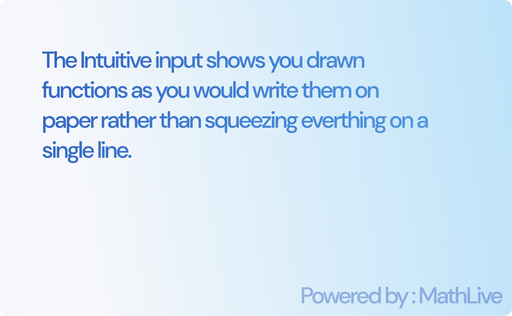
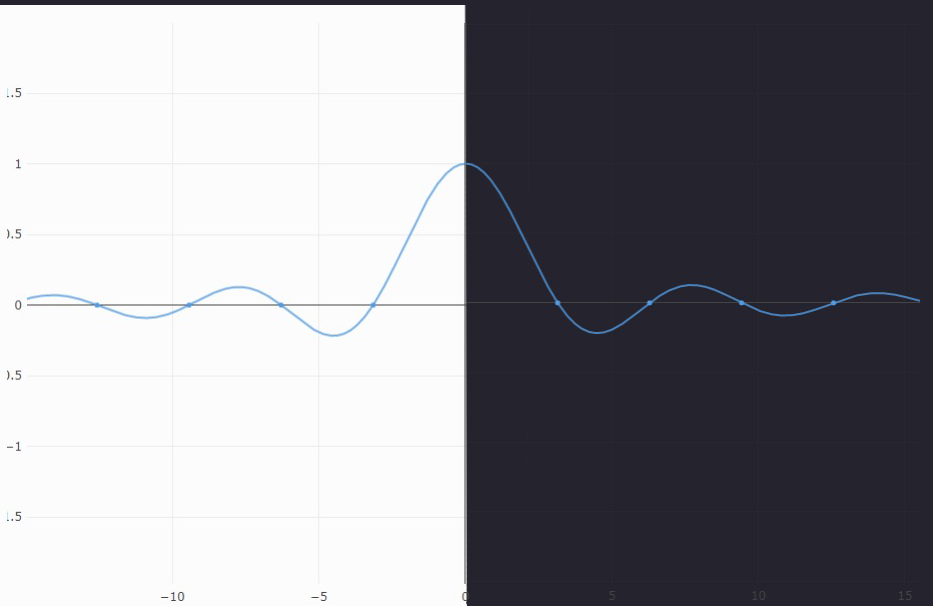

 

The Intuitive input shows you drawn functions as you would write them on paper rather than squeezing everthing on a single line.

## Using Sidus

This is the best part about Sidus.
Its Super Simple to use

1. Input the function, just as you would write it on paper.
2. Input the domain of x.
3. Voila! You get the graph of exactly what you want.

### Interact with your Graph

*  Pan around the graph as you will.
*  Zoom in to see details.
*  Save a png image of what you just plotted
*  Go back to default view.

## Know the Creator

 

### Prakrisht Dahiya </a>

    

 
 
 
 

## Issues and Suggestions
[You can suggest features and point out bugs here](https://github.com/beetrandahiya/Sidus/issues)

## License
This project is licensed under the [MIT License](../blob/master/LICENSE)

